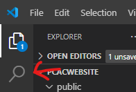
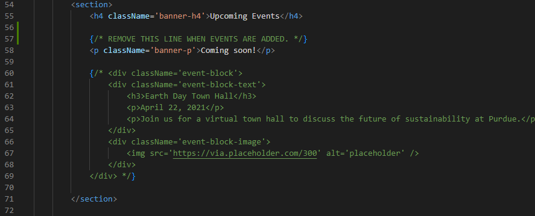
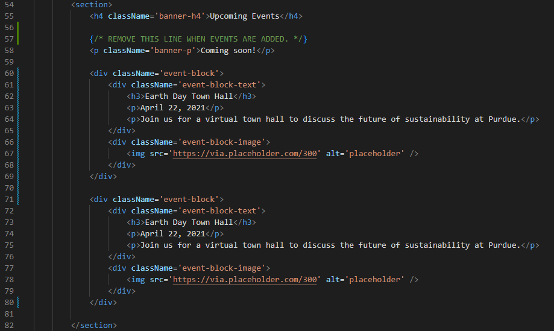
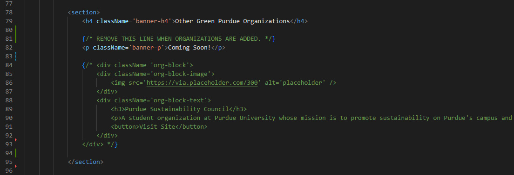
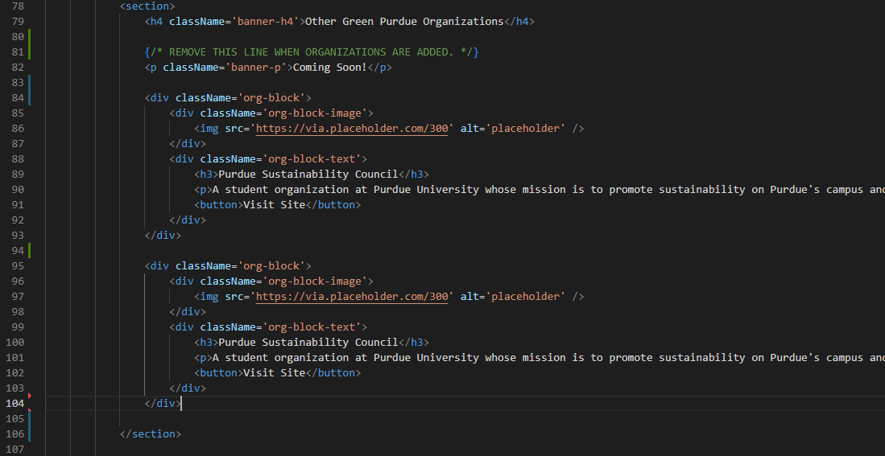

# PCACWebsite

## Website Modification Documentation

### Modifying Existing Content



Use the magnifying glass icon to search for the content you want to modify. Click on the file to open it. This search bar will search through all the files in the local repository.

### Adding New Content

All pages are held in the /pages directory. To change a specific page, navigate to the file corresponding to the page. For example, to change the home page, navigate to `/pages/index.tsx`. To change the about page, navigate to `/pages/about.tsx`.

### Adding New Components

Adding new components can vary due to how the code is written. 

1) Adding a new Timeline element to the about page:
    - Navigate to `/pages/about.tsx`
    - At the top of the page, there exists a `timelineData` variable. This variable holds all the data for the timeline. To add a new element, add a new object to the array. The object should have the following structure:
    ```javascript
    {
        title: 'Fall 2022',
        content: "PCAC begins as a group of faculty concerned about Purdue's commitments to       fighting climate change on campus.",
        image: '/images/timeline/profstanding.png',
    },
    ```
    - Ensure that every object (the element wrapped between the curly braces) has a comma seperating it from the previous object.
    - The `title` field is the title of the timeline element. The `content` field is the content of the timeline element. The `image` field is the image that will be displayed on the timeline element. The `image` field is **optional**.
    - To attach an image to the timeline element, add the image to the `/public/images/timeline` directory. Then, add the image URL to the `image` field.


2) Adding Upcoming Events
    - Navigate to `/pages/getinvolved.tsx`
    
    - Observe that there is green text in the image above. This is commented code (code that is not run by the website). To comment and uncomment code, highlight the code you'd like to perform an operation on and press `Ctrl + /`. To add a new event, uncomment the code, copy the code (Line 60 to line 69), and paste it below the "Coming Soon" text. Here's an example of what the code could look like:
    
    - Be sure to change the date, time, and description of the event after you copy and paste the code. 


3) Adding a new block to the "In The Media" section
    - Navigate to `/pages/getinvolved.tsx`
    - At the top of the page, you will see a variable named `mediaData`. This variable holds all the data for the media section. To add a new element, add a new object to the array. The object should have the following structure:
    ```javascript
    {
        title: 'Title of the Article',
        titleUrl: 'https://www.purdueexponent.org/campus/article_72ac8dc6-bd6c-11ed-ba62-d3439447c44e.html',
        image: 'images/inthemedia/big10.jpg',
    },
    ```
    - The `title` field is the title of the article. The `titleUrl` field is the URL of the article. The `image` field, `content` field, and `titleUrl` fields are **optional**.
    - Ensure that every object (the element wrapped between the curly braces) has a comma seperating it from the previous object.
    - To attach an image to the media element, add the image to the `/public/images/inthemedia` directory. Then, add the image URL to the `image` field.

4) Adding a new block to the "Other Green Purdue Organizations" section
    - Navigate to `/pages/getinvolved.tsx`
    
    - Observe that there is green text in the image above. This is commented code (code that is not run by the website). To comment and uncomment code, highlight the code you'd like to perform an operation on and press `Ctrl + /`. To add a new organization, uncomment the code, copy the code (Line 84 to line 93), and paste it below the "Other Green Purdue Organizations" text. Here's an example of what the code could look like:
    
    - To change the image of the organization, place the url of the image in the `` block. Replace the placeholder link (https://via.placeholder.com/300) with the image URL.


## Help!
Please contact me at `agneyat2@gmail.com` if you need any help! If you're unable to make a certain change to the website, send me the text you'd like to add and I'll add it for you. It will not take me much time!
